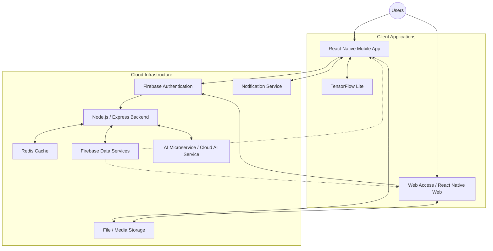

# System Architecture

*Note: This document outlines the proposed system architecture. The application and all specific components listed below are not currently implemented.*

## High-Level Architecture Diagram

## Data Flows

### Personalized Workout Flow
User fitness profile data → mobile application → on-device inference (TensorFlow Lite) OR backend AI Microservice → personalized workout recommendation → mobile application → user.

### Nutrition Tracking Flow
Meal input data → mobile application → REST API processing → database storage → compiled nutrition summary delivered to client.

### Social Sharing Flow
User workout completion → application → backend verification → Firebase Data Services → real-time synchronization → community user feeds.

## Security Considerations
- Enforcement of HTTPS for all client-server communications.
- Secure token-based user authentication and session management.
- Granular access control and row-level security on databases.
- Strict API input validation to prevent injection attacks.
- Robust data privacy measures, including encryption at rest for sensitive health data.
- Secure and isolated storage of API keys and environment variables.
- Minimum necessary user-data collection practices.
- Clear user consent prompts prior to processing fitness data.
- Implementation of API rate limiting to prevent abuse.

## Scalability Considerations
- Leveraging Firebase for automatic scaling of real-time data connections.
- Designing stateless Node.js backend services to allow for horizontal scaling via load balancers.
- Utilizing Redis Cache to reduce repetitive database queries for common data (e.g., standard workout templates).
- Independent scaling capabilities for the AI Microservice.
- Offloading simple AI inference to on-device processing (TensorFlow Lite) to reduce server bottlenecks.
- Utilizing dedicated object storage and CDNs for efficient media delivery.
